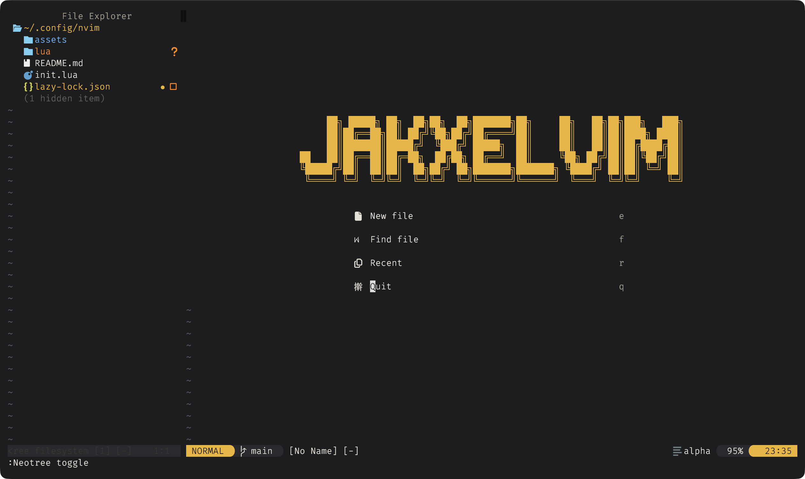
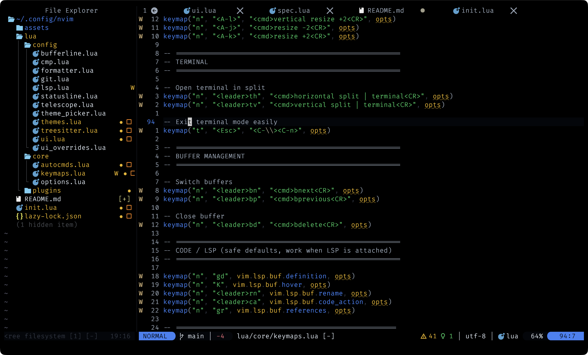

# Jakxelvim — Modern Neovim IDE Config

A modern, modular, IDE-like Neovim configuration focused on performance, clarity, and full theme control.

Built for developers who want a VS Code–like workflow while keeping Neovim's power and minimalism.

---

## Screenshots




---

## Features

### 🖥 UI & Experience
- Alpha Dashboard with custom `Jakxelvim` startup logo  
- Custom Theme Engine with persistent theme saving  
- Dynamic Theme Selector  
- Lualine statusline  
- Bufferline tab-style buffer navigation  
- Devicons for consistent icon support  
- Which-key keybinding helper  
- Autopairs automatic bracket/quote pairing  

---

### Navigation
- Neo-tree file explorer (project-aware)
- Telescope fuzzy finder:
  - Find files
  - Live grep
  - Buffers
  - Recent files

---

### Language Support
- Treesitter advanced syntax highlighting
- LSP via Mason + lspconfig
- Semantic token support
- Diagnostics with undercurl styling

---

### Autocomplete
- nvim-cmp
- LSP completion source
- Snippet support via LuaSnip
- Tab-based completion workflow

---

### Theme System

Jakxelvim includes a fully custom theme engine — not just a colorscheme.

The configuration ships with multiple prebuilt themes, and you can easily create your own custom themes by defining a new color palette inside the theme module.

The system supports:

- Full UI recoloring
- Treesitter integration
- LSP semantic tokens
- Diagnostic styling
- Floating window styling
- Neo-tree integration
- Statusline adaptation
- Alpha dashboard styling
- Persistent theme saving

---

## Plugin Stack

### UI
- folke/tokyonight.nvim
- mcchrish/zenbones.nvim
- nvim-lualine/lualine.nvim
- akinsho/bufferline.nvim
- nvim-tree/nvim-web-devicons
- goolord/alpha-nvim

### Navigation
- nvim-neo-tree/neo-tree.nvim
- nvim-telescope/telescope.nvim

### Syntax
- nvim-treesitter/nvim-treesitter

### LSP
- neovim/nvim-lspconfig
- williamboman/mason.nvim
- williamboman/mason-lspconfig.nvim

### Autocomplete
- hrsh7th/nvim-cmp
- hrsh7th/cmp-nvim-lsp
- L3MON4D3/LuaSnip

### Formatting
- stevearc/conform.nvim

### Git
- lewis6991/gitsigns.nvim

### UX
- folke/which-key.nvim
- windwp/nvim-autopairs
- famiu/bufdelete.nvim

---

## Requirements

- Neovim 0.9+
- Git

Optional formatters:
- stylua
- black
- prettier

---

## Installation

Clone the repository:

```bash
git clone https://github.com/<your-username>/<your-repo-name>.git ~/.config/nvim
```

Open Neovim:

```bash
nvim
```

Lazy.nvim will automatically install all plugins on first launch.

---

## Philosophy

Jakxelvim focuses on:

- Clean UI
- Strong color identity
- IDE-level productivity
- Modular architecture
- Theme consistency across UI, LSP, and plugins
