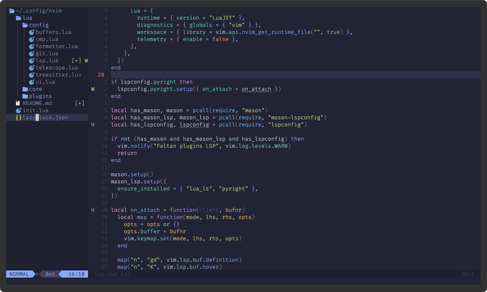

# Neovim IDE Config

My personarl Nvim config a **modern, IDE-like Neovim setup** with **Neo-tree, LSP, Treesitter, autocomplete, Telescope, bufferline, Git integration, and formatting**.  
Designed for developers who want a **VS Code-like experience** in Neovim.  

---

## Features

- **File Explorer:** Neo-tree with project root detection and file reveal  
- **Buffers:** Visual bufferline tabs for easy navigation  
- **Autocomplete:** nvim-cmp with snippet support and Tab navigation  
- **Fuzzy Finder:** Telescope for files, live grep, and buffers  
- **Syntax Highlighting:** Treesitter support for multiple languages  
- **LSP:** Mason-managed LSP servers for Lua, Python, JavaScript, etc.  
- **Git:** gitsigns integration for inline Git changes  
- **Formatting:** Conform-based formatting for supported languages  
- **Keymaps:** Ergonomic leader-based keymaps for navigation and productivity  
- **Theme:** Tokyo Night colorscheme for a clean modern look  

---

## Screenshot



---

## Requirements

- Neovim 0.9+  
- Git  
- Optional: `stylua`, `black`, `prettier` for formatting  

---

## Installation

1. Clone this repository:

```bash
git clone https://github.com/<your-username>/<your-repo-name>.git ~/.config/nvim

2.	Open Neovim:

```bash
nvim

3. The Lazy.nvim plugin manager will automatically install all plugins on first start.

